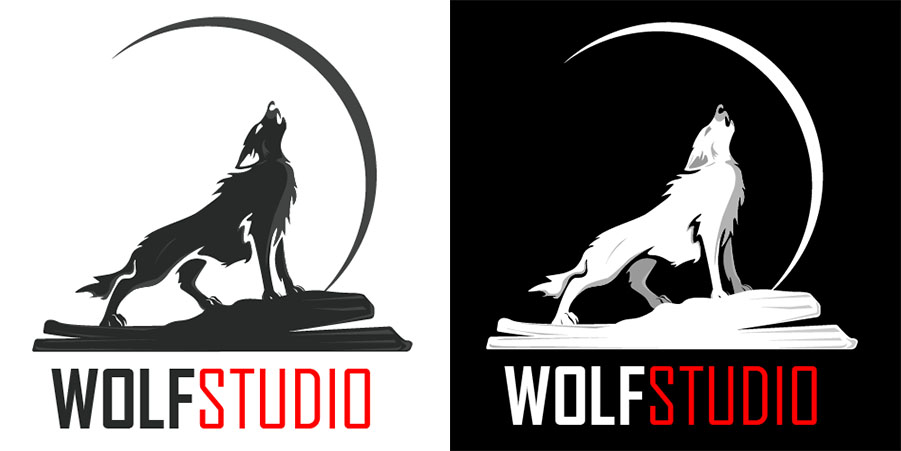

## About the Company

WOLFSTUDIO is the world's leader in visual effects prep outsourcing. Our staff of 1000 has delivered over 80,000 
high-quality shots for companies around the globe, big and small. Find out how we can help you.

Founded in 2010 by former staff from The Mill, we set out to create a Western-style VFX operation in Mumbai.
Initially focused on rotoscoping, the breadth of services quickly grew to include paint, tracking, 3D, and 
pipeline development. 

We believe that running a successful visual effects company is dependent on attracting and retaining the best 
talent. Recently named the number one VFX company to work for in India, we produce the highest quality work by 
nurturing the best people. Trace is not a factory. We are a consistent and responsible partner for 
the world’s VFX industry.

This project is about to represet an oraganization into market by advertising thier services and all
by developing and lauching the website into the industry.

To know more about visual effects and Animation [Click Here](https://en.wikipedia.org/wiki/Visual_effects).

## Getting Started

There are certain steps needs to be completed before making actual project using any languages.
1. Research and Brain Storm about the Client's Requirement
2. Visualize the data and carve ideas into blank paper
3. After deciding the best design from the paper sketch, start to design your website by using 
```Adobe Illustrator``` and ```Adobe Photoshop```
4. Send your design to client for conformation otherwose re-work on it.
5. After fixing the design,Create web page using ```HTML```, ```CSS``` and ```PYTHON```.
6. Launch website

Some References/observation that I looked after for this projects:

1. [SideFx](https://www.sidefx.com/)
2. [SpinVFX](https://www.spinvfx.com/)


***IMPORTANT POINTS***

- Needs to be simple and attactive. so that, people can easily understand about the meaning  
  behind the project and can also navigate very easily.

### Authors

1. Deepkumar Patel(0953510)

## License 

This project is licensed under the **WOLF STUDIO**.

© Copyrights Reserved.
